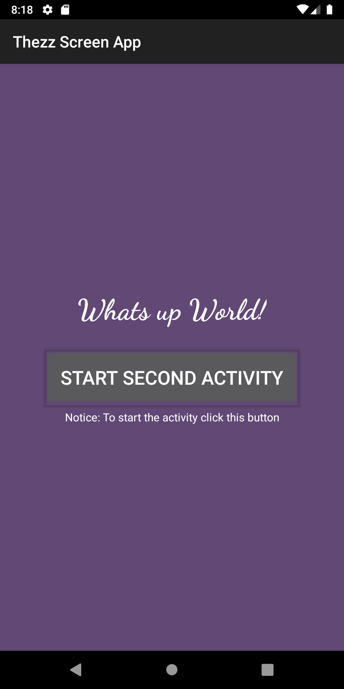
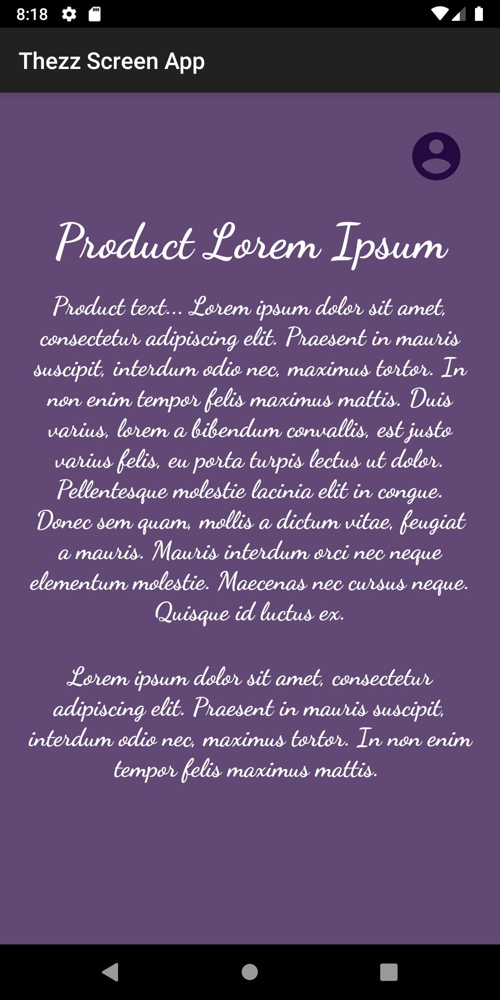
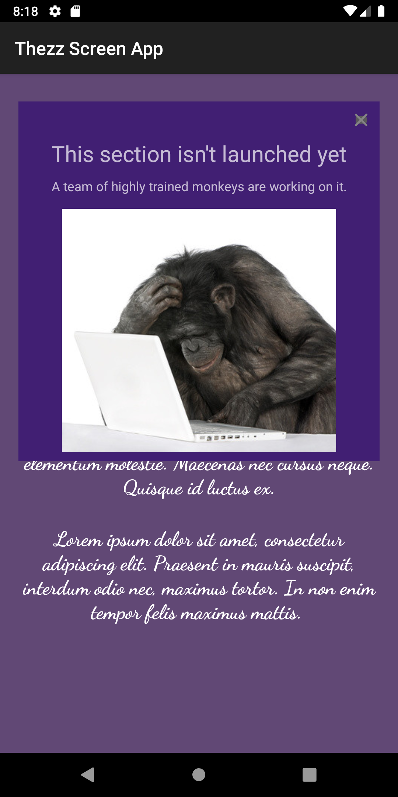

RAPPORT ASSIGNMENT 4

Beskrivning uppgift.
Denna uppgift gick ut på att öva sig att arbeta med screens, intent och fragments. Jag började med
döpa om min app, sedan la till två textelement och sedan en knapp i layoutfilen för mainactivity.
Sedan kodade jag knappen för att öppna upp en ny aktivitet vilken jag även skapade. I den nya
aktiviteten la jag till en ikon i övre högra hörnet som jag sedan skulle koppla mitt fragment till.
Istället för att använda ImageView valde jag ImageButton. När det var fixat skapade jag en
Framelayout som var tom och gav den id fragmentContainer. Sedan i onClick för min ImageButton la jag
till koden för att ersätta min Framelayout via dess id med mitt fragment. Resultatet blev att när
man klickade på ikonen så öppnas fragmentet upp över MainActivity2. Jag la till lite innehåll i
mitt fragment som jag presenterade med hjälp av en Linearlayout med orientation vertikal och
gravity center. Som sista sak fixade jag ett stängkryss för mitt fragment så det gick att klicka
bort det genom att lägga till en ikon av ett kryss och sedan gjortde jag en ImageButton i
onCreateView i mitt fragment där jag gjorde så att när man klickade på det så togs
min fragmentcontainer (framelayout) bort och fragmentet "stängdes".

KODSNUTT FRÅN MIN APP

Koden från MainActivity2 som öppnar mitt fragment
```
 @Override
    protected void onCreate(Bundle savedInstanceState) {
        super.onCreate(savedInstanceState);
        setContentView(R.layout.activity_main2);

        ImageButton buttonFragment = findViewById(R.id.accountButton);
        buttonFragment.setOnClickListener(new View.OnClickListener() {
            @Override
            public void onClick(View v) {
                Log.d("MainActivity2 -->", "Start fragment");
                getSupportFragmentManager().beginTransaction().replace(R.id.fragmentContainer, new FirstFragment()).setReorderingAllowed(true).commit();
            }
        });

    }
```
Kodsnytt från mitt Fragment för att stänga det igen när man klickar på min ImageButton som har
id close.
```
@Override
    public View onCreateView(LayoutInflater inflater, ViewGroup container,
                             Bundle savedInstanceState) {

        View view = inflater.inflate(R.layout.fragment_first, container, false);

        ImageButton close = view.findViewById(R.id.close);
        close.setOnClickListener(new View.OnClickListener() {
            @Override
            public void onClick(View v) {
                Log.d("First Fragment -->", "Close fragment");
                getFragmentManager().beginTransaction().remove(getFragmentManager().findFragmentById(R.id.fragmentContainer)).setReorderingAllowed(true).commit();
            }
        });

        return view;
    }
```

SCREENSHOTS FRÅN APPEN

MainActivity


MainActivity2


FirstFragment


